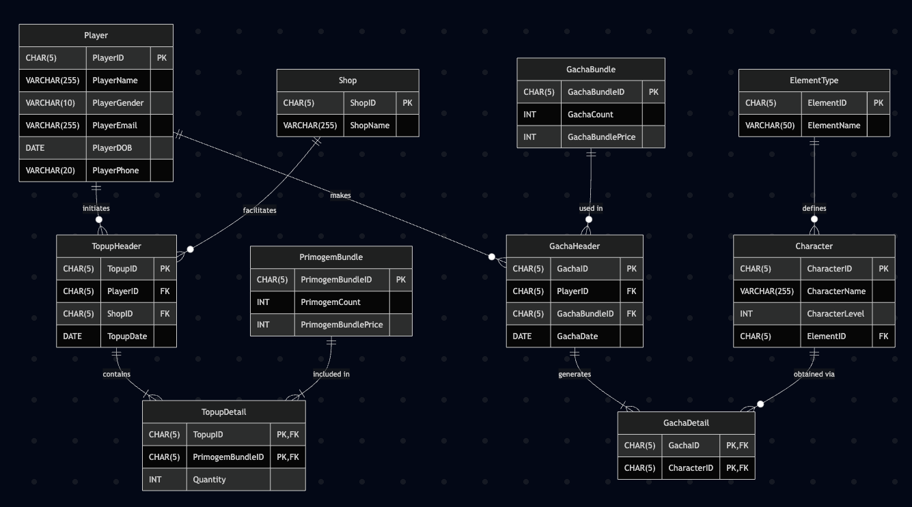

# Elyndria: Database Management Project

## 📌 Project Overview
**Elyndria** is a database management project designed for **MiZoyo**, a game development company. The goal of this project is to transition Elyndria's data management from a manual system to a robust **Relational Database Management System (RDBMS)**. This system tracks player activities, specifically focusing on **Gacha** (character summoning) and **Top-up** (currency purchase) transactions.

## 🎯 Objectives
The project involves designing and implementing a database solution that:
- Stores comprehensive data on **Players**, **Characters**, **Elements**, **Shops**, and **Bundles**.
- Tracks **Top-up Transactions**: Players buying Primogems from various shops.
- Tracks **Gacha Transactions**: Players spending Primogems to obtain characters.
- Enforces data integrity through strict validation rules (e.g., ID formats `PLXXX`, Age restrictions, Email validation).
- Provides business intelligence through complex SQL queries.

## 📂 Database Schema
The database consists of the following key entities:
- **Player**: Stores profile info (ID, Name, Email, DOB, Phone).
- **Shop**: Retailers selling in-game currency.
- **PrimogemBundle**: Currency packages available for top-up.
- **TopupHeader/Detail**: Records of purchase transactions.
- **GachaBundle**: Summoning packages (e.g., 1-pull, 10-pull).
- **GachaHeader/Detail**: Records of summoning history and results.
- **Character**: Collectible game characters with specific Levels and Elements.
- **ElementType**: Elemental attributes (Pyro, Hydro, Anemo, etc.).

## 🛠️ Tech Stack
- **Database**: SQL (Compatible with SQL Server / SQLite)
- **Modeling**: Entity Relationship Diagram (ERD) using Visual Paradigm
- **Languages**: SQL (DDL, DML)

## 📄 Project Structure
This repository contains the following SQL scripts:

1.  **`1_DDL.sql`**: 
    - Defines the database schema.
    - Creates tables with Primary/Foreign Keys.
    - Implements Check Constraints for data validation (e.g., Gender 'Male'/'Female', Indonesian Phone format `+62...`).

2.  **`2_InsertData.sql`**: 
    - Populates the database with initial dummy data.
    - Includes master data (Players, Characters, Shops) and transaction history.
    - Ensures specific constraints (e.g., >15 records) are met.

3.  **`3_SimulateTransactions.sql`**: 
    - Contains SQL scripts to simulate real-time business processes (New Top-up and Gacha events).

4.  **`4_Queries.sql`**: 
    - A collection of 10 complex analytical queries solving specific business cases, such as:
        - *Identifying high-spending players.*
        - *Analyzing character acquisition rates.*
        - *Calculating shop profitability in specific quarters.*

5.  **`ERD_Diagram.png`**: 
    - Visual representation of the database relationships.


## 🚀 How to Run
You can execute the scripts in any standard SQL environment. For a quick command-line execution using SQLite:

```bash
# 1. Initialize Schema
sqlite3 Elyndria.db < 1_DDL.sql

# 2. Populate Data
sqlite3 Elyndria.db < 2_InsertData.sql

# 3. Process Simulation
sqlite3 Elyndria.db < 3_SimulateTransactions.sql

# 4. Execute Analysis Queries
sqlite3 -header -column Elyndria.db < 4_Queries.sql
```

## 📊 Key Highlights
- **Data Integrity**: Implemented rigorous constraints (`GLOB`/`CHECK`) to ensure valid ID formats (`PLXXX`, `SHXXX`, etc.) and data logic.
- **Complex Reporting**: SQL queries utilize `JOIN`, `GROUP BY`, `HAVING`, `SUBQUERIES`, and `VIEWS` to derive meaningful insights.
- **Scalability**: Normalized database design (3NF) to minimize redundancy.

Elyndria 2023 - Developed by Fauzan Rahmat Farghani
